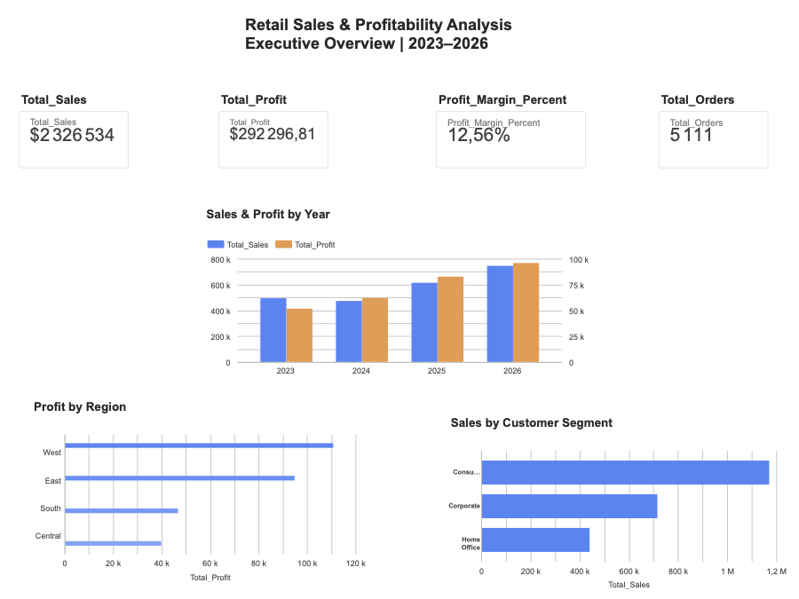
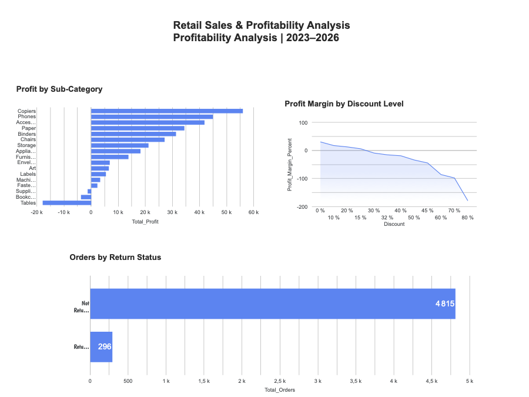

# Retail Sales & Profitability Analysis

## Project Overview

This project analyzes retail sales data to evaluate overall business performance, profitability, customer segments, regional performance, discounting patterns, product performance, and returns.

In this project, I used SQL and Google BigQuery to audit, clean, transform, validate, and analyze the data, then developed a two-page Looker Studio dashboard to communicate the key business insights.

The objective was not only to identify which areas generated the most sales, but also to determine which parts of the business were actually profitable and where potential profitability issues existed.

The project follows an end-to-end data analytics workflow, from data preparation and quality checks to SQL analysis, business insights, and dashboard development.

---

## Business Questions

The analysis was designed to answer the following questions:

- How is the business performing overall in terms of sales, profit, orders, and profit margin?
- How have sales and profit evolved over time?
- Which product categories and sub-categories generate the strongest and weakest profitability?
- How are discounts associated with profitability?
- Which regions perform best and worst?
- Which customer segments contribute the most to sales and profit?
- What proportion of orders are returned?
- What business opportunities or risks can be identified from the data?

---

## Tools Used

- **Microsoft Excel** — initial file preparation
- **Google BigQuery / SQL** — data auditing, cleaning, transformation, validation, and business analysis
- **Looker Studio** — dashboard development and data visualization
- **GitHub** — project documentation and SQL portfolio

---

## Dataset

The project uses the **Tableau Sample Superstore** dataset.

The original Excel workbook contained three worksheets:

- **Orders** — transaction-level sales information
- **Returns** — identification of returned orders
- **People** — regional manager information

The Orders dataset contains information including order and shipping dates, customers, geographic location, product categories, sales, quantities, discounts, and profit.

Before loading the data into BigQuery, the workbook was separated into individual files corresponding to the three worksheets.

Some column names were also modified for compatibility with BigQuery:

- `Country/Region` → `Country_Region`
- `State/Province` → `State_Province`

---

## Data Audit

Before cleaning or analyzing the data, SQL queries were used to assess data quality and relational integrity.

The audit included:

- Row-count validation
- Duplicate checks
- Null-value checks
- Date validation
- Identification of negative profit values
- Validation of the Returns dataset
- Validation of the People dataset
- Checks for unmatched returned orders
- Checks for unmatched regions between Orders and People

The Orders dataset contained **10,194 rows representing 5,111 unique orders**.

No duplicate Row IDs or null values were identified.

The audit also identified an imported header row in the People table, which was removed during cleaning. All returned Order IDs matched records in the Orders dataset.

---

## Data Cleaning

A cleaned Orders table was created in BigQuery.

The main cleaning operations included:

- Converting imported Excel serial dates into valid SQL `DATE` values
- Renaming geographic fields
- Selecting and restructuring relevant columns
- Removing the imported header row from the People dataset
- Creating a cleaned People table
- Validating row counts and date relationships after transformation

The Returns dataset did not require a separate cleaned table because the audit found no duplicate Order IDs or unmatched return records requiring correction. Therefore, the original Returns table was retained for analysis.

---

# SQL Analysis

## Overall Performance

| Metric | Result |
|---|---:|
| Total Sales | $2,326,534.35 |
| Total Profit | $292,296.81 |
| Profit Margin | 12.56% |
| Total Orders | 5,111 |
| Total Customers | 804 |

Overall, the business was profitable during the period analyzed.

---

## Performance Over Time

Sales and profit generally increased between 2023 and 2026.

Sales declined slightly in 2024 compared with 2023, while profit and profit margin improved. Performance accelerated afterward, with **2026 recording the highest sales and total profit**.

---

## Product Profitability

Technology and Office Supplies generated substantially stronger profit margins than Furniture.

| Category | Sales | Profit | Profit Margin |
|---|---:|---:|---:|
| Technology | $839,893.28 | $146,543.38 | 17.45% |
| Office Supplies | $731,893.31 | $126,023.44 | 17.22% |
| Furniture | $754,747.76 | $19,730.00 | 2.61% |

Despite generating more than **$754K in sales**, Furniture produced a profit margin of only **2.61%**.

At the sub-category level, **Tables, Bookcases, and Supplies generated losses**.

Tables represented the largest profitability concern, generating approximately **$208K in sales while producing a loss of $17,753.21**.

---

## Discount Analysis

Profitability declined considerably as discount levels increased.

Orders with no discount generated an aggregate profit margin of approximately **29.56%**, while discount levels of **30% and above were associated with negative aggregate profit margins** in this dataset.

However, discounts should not be interpreted as the sole cause of losses. Some product groups remained profitable despite relatively high average discounting, indicating that other factors may also influence profitability.

---

## Regional Performance

The **West** was the strongest region by total profit, generating approximately **$110,799 in profit** and a **14.98% profit margin**.

The **Central** region had the lowest profit margin at **7.92%**, despite generating more sales than the South region.

This demonstrates that higher sales volume does not necessarily translate into stronger profitability.

---

## Customer Segments

The **Consumer** segment was the largest contributor to sales and total profit.

However, **Home Office achieved the highest profit margin at 14.02%**, compared with:

- Corporate — 13.17%
- Consumer — 11.65%

This again highlights the distinction between sales volume and profitability.

---

## Returns

Of the **5,111 unique orders**:

- **296** were returned
- **4,815** were not returned

Returned orders therefore represented approximately **5.8% of all orders**.

The dataset identifies whether an order was returned but does not provide the financial cost, refund amount, restocking cost, or other expenses associated with returns.

Therefore, the true financial impact of returned orders cannot be determined from the available data.

---

# Looker Studio Dashboard

The final dashboard was developed in **Looker Studio** and contains two pages. 

## Page 1 — Executive Overview

The Executive Overview presents:

- Total Sales
- Total Profit
- Profit Margin
- Total Orders
- Sales & Profit by Year
- Profit by Region
- Sales by Customer Segment

## Page 2 — Profitability Analysis

The Profitability Analysis presents:

- Profit by Sub-Category
- Profit Margin by Discount Level
- Orders by Return Status

Dedicated aggregate tables were created in BigQuery to support the dashboard. This simplified the connection between SQL analysis and Looker Studio and ensured that key business metrics were calculated consistently before visualization.

### Dashboard

**Looker Studio:** https://datastudio.google.com/s/hGuboqpgQ3E 

### Dashboard Preview

#### Executive Overview

#### Profitability Analysis

---

# Key Findings

- The business generated **$2.33M in sales and $292.3K in profit**, with an overall profit margin of **12.56%**.
- Business performance generally strengthened between 2023 and 2026.
- Furniture generated strong sales but weak profitability, with a margin of only **2.61%**.
- Tables were the largest loss-making sub-category despite generating substantial sales.
- Higher discount levels were associated with significant deterioration in profitability.
- The West region generated the highest profit, while Central recorded the weakest regional margin.
- Consumer generated the most sales, while Home Office achieved the highest profit margin.
- Approximately **5.8% of orders were returned**, although the dataset does not contain sufficient information to calculate their true financial impact.

---

# Business Recommendations

Based on the analysis:

1. **Review Furniture profitability**, particularly Tables and other loss-making sub-categories, to identify potential pricing, cost, or product-mix issues.

2. **Evaluate high-discount transactions more carefully**, particularly at discount levels associated with aggregate losses.

3. **Investigate the Central region's weaker profitability** and compare its product mix and operating patterns with stronger-performing regions such as the West.

4. **Protect the Consumer segment's strong sales contribution** while investigating whether strategies associated with the higher-margin Home Office segment can be expanded.

5. **Collect more detailed return-related financial information** to evaluate the true cost and business impact of returned orders.

---

# Limitations

- The project uses a sample retail dataset rather than live company data.
- The dataset does not provide the direct financial cost of product returns.
- Relationships identified between discounts and profitability represent associations and should not automatically be interpreted as causation.
- The analysis is based on the variables available in the dataset. Additional information such as product costs, marketing expenses, shipping costs, and operational expenses could provide deeper profitability insights.

---

# Repository Structure

    retail-sales-profitability-analysis/
    │
    ├── README.md
    │
    ├── sql/
    │   ├── 01_data_audit.sql
    │   ├── 02_data_cleaning.sql
    │   ├── 03_business_analysis.sql
    │   └── 04_dashboard_preparation.sql
    │
    ├── images/
    │   ├── executive_overview.png
    │   └── profitability_analysis.png
    │
    └── documentation/
        └── data_process.md

---

## Skills Demonstrated

SQL • BigQuery • Data Cleaning • Data Validation • Data Transformation • Exploratory Data Analysis • Business Analysis • Profitability Analysis • Data Visualization • Looker Studio • Data Storytelling

---

## Feedback Welcome

This project is part of my data analytics portfolio and ongoing learning journey.

Constructive feedback is welcome, particularly on the SQL analysis, data preparation process, dashboard design, business insights, and recommendations.

If you identify an area that could be improved or have a different interpretation of the results, feel free to start a discussion.
